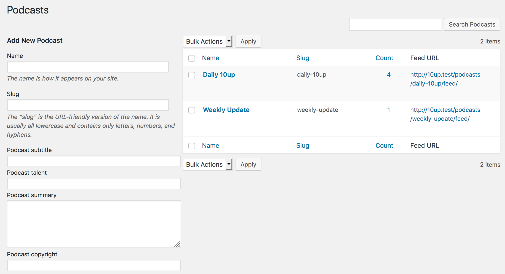
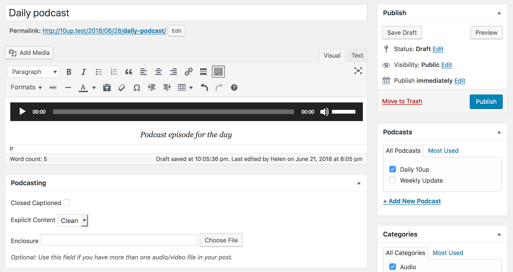

# Simple Podcasting for WordPress

Easily set up multiple podcast feeds using built-in WordPress posts. Includes a podcast block for Gutenberg support.

Podcasting is a method to distribute audio messages through a feed to which listeners can subscribe. You can publish podcasts on your WordPress site and make them available for listeners in Apple Podcasts and through direct feed links for other podcasting apps by following these steps:

## Create your podcast

From wp-admin, go to Podcasts.
To create a podcast, complete all of the "Add New Podcast" fields and click 'Add New Podcast'.
 * Podcast title: this title appears in Apple Podcasts and any other podcast apps.
 * Podcast subtitle: the subtitle also appears in Apple Podcasts and any other podcast apps.
 * Podcast talent name: the artist or producer of the work.
 * Podcast summary: Apple Podcasts displays this summary when browsing through podcasts.
 * Podcast copyright: copyright information viewable in Apple Podcasts or other podcast apps.
 * Mark as explicit: mark yes if podcast contains adult language or adult themes.
 * Podcast image: add the URL for the cover art to appear in Apple Podcasts and other podcast apps. Click "Select Image" and choose an image from the Media Library. Note that podcast cover images must be between 1400 x 1400 and 3000 x 3000 pixels in JPG or PNG formats to work on Apple Podcasts.
 * Podcast keywords: add terms to help your podcast show up in search results on Apple Podcasts and other podcast apps.
 * Podcast categories: these allow your podcast to show up for those browsing Apple Podcasts or other podcast apps by category.

Repeat for each podcast you would like to create.

## Add content to your podcast

 * Create a new post and assign it to one or more Podcasts using the panel labeled Podcasts.
 * Upload or embed an audio file into this post using any of the usual WordPress methods. If using the new block-based WordPress editor (referred to as Gutenberg), insert a Podcast block. Only one Podcast block can be inserted per post.
 * For more advanced settings, use the Podcasting meta box to mark explicit content or closed captioning available and to optionally specify one media item if the post if you have more than one in your post. In Gutenberg, these are the block settings that appear in the sidebar when the podcast block is selected.

## Submit your podcast feed to Apple Podcasts

* Each podcast has a unique feed URL you can find on the Podcasts page. This is the URL you will submit to Apple.
* Ensure you test feeds before submitting them, see https://help.apple.com/itc/podcasts_connect/#/itcac471c970.
* Once the validator passes, submit your podcast. Podcasts submitted to Apple Podcasts do not become immediately available for subscription by others. They are submitted for review by Apple staff, see https://help.apple.com/itc/podcasts_connect/#/itcd88ea40b9

Podcast setup | Podcast in editor | Podcast feed
------------- | ----------------- | ------------
 |  | 

### Technical Notes

* Requires PHP 5.3+.
* RSS feeds must not be disabled.

## Contributing

Want to help? Check out our [contributing guidelines](CONTRIBUTING.md) to get started.

## Installation
1. Install the plugin via the plugin installer, either by searching for it or uploading a .zip file.
2. Activate the plugin.
3. Head to Posts → Podcasts and add at least one podcast.
4. Create a post and insert an audio embed (or a podcast block in Gutenberg) and select a Podcast feed to include it in.

## Changelog

### 1.1.0

* Added: Retrieve metadata for externally hosted audio files in the block editor.
* Added: Specify email address for a given podcast.
* Added: Set language for a given podcast.
* Tweaked: Clearer language on the add new podcast form.
* Bug fix: Delete all associated meta when block is removed from a post.
* Bug fix: Restore all block editor functionality to align with Gutenberg changes.
* Bug fix: Fully clear add new form after creating a new podcast.
* Developers: Add linting for coding standards.

### 1.0.1
* Bug fix: Properly output podcast categories and subcategories in the feed.
* Bug fix: Avoid a minified JS error when selecting a podcast image.
* Bug fix: Display podcast summary on edit form.

### 1.0
* Initial plugin release
